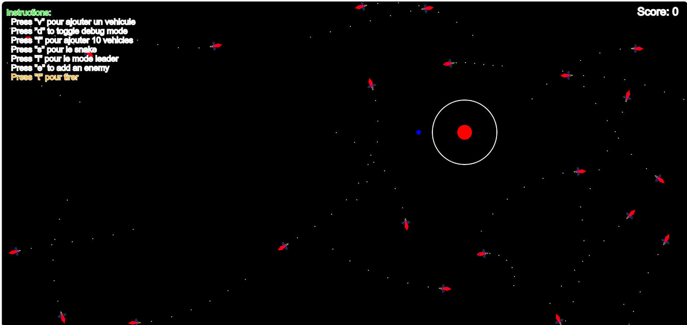

# project_game_P5_MASKI
P5 game created
<h2>Fonctionnalitées developées</h2>
<h1>Comportement du leader</h1>
Logique pour le leader:

Si le véhicule est un leader (isLeader est vrai), la méthode calcule différentes forces pour guider le mouvement du leader.

seekForce: Force pour atteindre la cible.
avoidForceObstacles: Force pour éviter les obstacles.
separationForce: Force pour maintenir la séparation avec les autres véhicules.
Ces forces sont ensuite pondérées avec des coefficients et appliquées au véhicule en utilisant la méthode applyForce.

Logique pour les suiveurs:

Si le véhicule n'est pas un leader, il suit le leader (premier véhicule dans le tableau vehicules).

Si le véhicule est trop proche du leader, il essaie de s'éloigner en créant une force d'évitement.
Sinon, il suit le leader en créant une force de suivi.
Ces forces sont également appliquées au véhicule en utilisant applyForce.

En résumé, cette méthode modélise le comportement de deux types de véhicules dans un environnement simulé: des leaders qui cherchent une cible tout en évitant les obstacles et en maintenant une séparation avec d'autres véhicules, et des suiveurs qui suivent un leader en évitant de se rapprocher trop près. La simulation semble utiliser des concepts de forces et de vecteurs pour modéliser le mouvement et les interactions entre les véhicules et leur environnement.
</img>
<h1>Comportement du wander</h1>
Calcul de la position de déplacement aléatoire (wanderPoint):

wanderPoint est initialisé comme une copie de la vélocité actuelle du véhicule.
Sa magnitude est ensuite réglée sur la distance spécifiée (distanceCercleWander) pour déterminer la distance du point de déplacement par rapport à la position actuelle.
Les coordonnées de ce point sont ensuite ajustées pour obtenir la position réelle (wanderPoint) sur laquelle le véhicule doit se diriger.
Calcul de la position en fonction de l'angle (theta) et du rayon (wanderRadius):

L'angle (theta) est déterminé à partir de la direction actuelle du véhicule (this.vel.heading()).
Les coordonnées (x et y) du point de déplacement sont calculées en utilisant l'angle, le rayon de déplacement (wanderRadius), et ajoutées à la position actuelle du véhicule.
Évitement d'obstacles pendant le mouvement aléatoire:

La méthode avoid est appelée pour calculer une force d'évitement par rapport aux obstacles présents dans le tableau obstacles.
La force d'évitement est pondérée avec un facteur (1.5) et appliquée au véhicule avec applyForce.
Calcul de la force pour atteindre le point de déplacement (wanderPoint):

La force désirée est calculée en soustrayant la position actuelle du véhicule de wanderPoint.
La magnitude de cette force est réglée sur la force maximale possible (maxForce).
La force est ensuite appliquée au véhicule avec applyForce.
Ajout d'une composante aléatoire au déplacement (wanderTheta):

La variable wanderTheta est mise à jour avec une valeur aléatoire dans une plage spécifiée (displaceRange).
Vérification des limites de l'écran:

La fonction checkScreenBoundaries est appelée pour s'assurer que le véhicule reste à l'intérieur des limites de l'écran.
Fonction checkScreenBoundaries
Cette fonction vérifie si la position actuelle du véhicule dépasse les limites de l'écran et ajuste la vélocité et la position en conséquence.

Si la position dépasse les limites horizontales de l'écran, la composante horizontale de la vélocité est inversée (this.vel.x *= -1).
Si la position dépasse les limites verticales de l'écran, la composante verticale de la vélocité est inversée (this.vel.y *= -1).
Les positions x et y sont ensuite contraintes pour garantir que le véhicule reste à l'intérieur des limites de l'écran.
</img>
<h1>Comportement du snack</h1>
le comportement des véhicules dans une simulation en utilisant la méthode applyBehaviors() pour définir comment chaque véhicule réagit à la cible, aux obstacles et aux autres véhicules. La fonction gère également des cas spécifiques pour le premier véhicule, notamment en ajustant sa position pour éviter d'entrer dans un certain rayon autour de la cible.

</img>

<h1>Comportement du tire</h1>

La création des tirs (bullets) se produit dans la fonction keyPressed() lorsque la touche "t" est pressée. Voici la partie de code correspondante :

javascript
Copy code
function keyPressed() {
  // ...
  if (key == "t") {
    // Logique de tir
    if (vehicules.length > 0) {
      vehicules.forEach(v => {
        let bullet = new Bullet(v.pos.x, v.pos.y, imgFire);
        bullets.push(bullet);
      });
    }
  }
  // ...
}
Cette partie du code s'exécute chaque fois qu'une touche du clavier est enfoncée. Si la touche "t" est pressée, une vérification supplémentaire est effectuée pour s'assurer qu'il y a au moins un véhicule (vehicules.length > 0). Si tel est le cas, une boucle forEach est utilisée pour itérer sur tous les véhicules dans le tableau vehicules. Pour chaque véhicule, une nouvelle instance de la classe Bullet est créée à partir de la position du véhicule (v.pos.x, v.pos.y) et de l'image du tir (imgFire). Cette instance de Bullet est ensuite ajoutée au tableau bullets.

</img>
<h1>Creation des enemis</h1>
le comportement des véhicules dans une simulation en utilisant la méthode applyBehaviors() pour définir comment chaque véhicule réagit à la cible, aux obstacles et aux autres véhicules. La fonction gère également des cas spécifiques pour le premier véhicule, notamment en ajustant sa position pour éviter d'entrer dans un certain rayon autour de la cible.
</img>

<h1>Comportement du tire sur les enemis</h1>
Si une collision est détectée, les actions suivantes sont effectuées :

La santé de l'ennemi (enemies[j].health) est décrémentée.
Si la santé de l'ennemi atteint zéro ou moins, cela signifie que l'ennemi est tué.
Le score est augmenté.
L'ennemi est retiré du tableau enemies à l'indice j.
La balle qui a touché l'ennemi est également retirée du tableau bullets à l'indice i.
Cela se fait à l'intérieur d'une boucle for qui parcourt les balles de la fin au début (bullets.length - 1) pour éviter des problèmes liés à la suppression d'éléments d'un tableau pendant que vous le parcourez.

En résumé, lorsqu'une balle touche un ennemi, la santé de l'ennemi est réduite, et si sa santé atteint zéro, l'ennemi est tué, ce qui entraîne l'augmentation du score et la suppression de l'ennemi et de la balle associée des tableaux respectifs.
</img>

